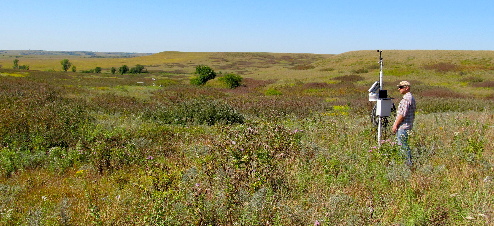
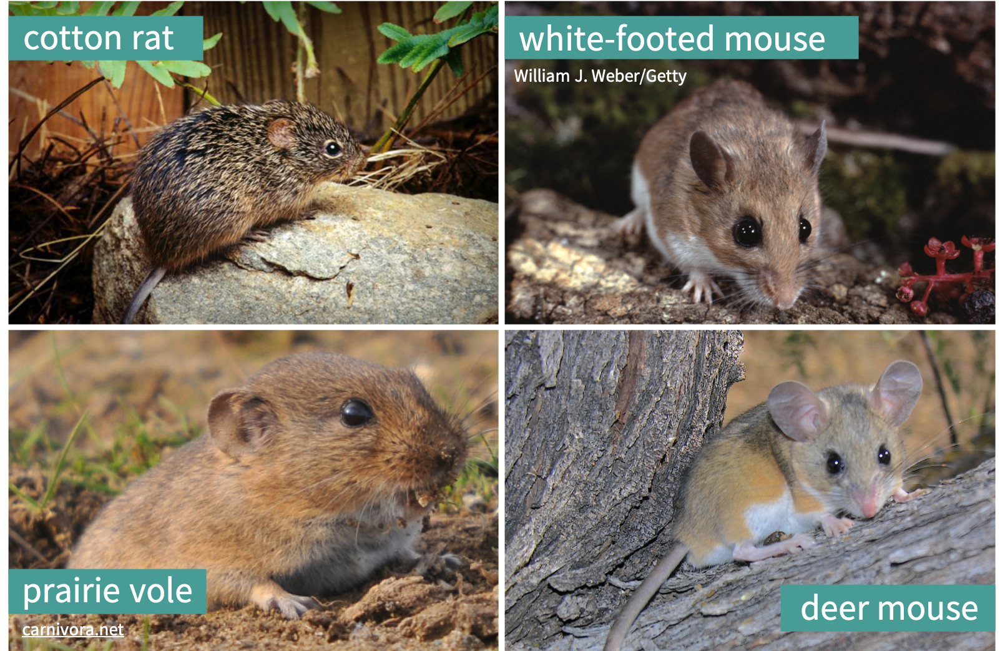

<style>
@import url('https://fonts.googleapis.com/css2?family=Roboto+Mono&family=Roboto+Slab&family=Source+Sans+Pro:wght@300;400&display=swap');
</style> 

```{r setup, include=FALSE}
# Attach packages:

library(learnr)
library(here)
library(tidyverse)
library(janitor)
library(naniar)
library(skimr)
library(kableExtra)
library(fontawesome)

# Global code chunk settings:
knitr::opts_chunk$set(echo = FALSE)

# Create objects use throughout tutorial:

# Read in data as `kp_rodents`
kp_rodents <- read_csv(here::here("data","kp_mammals.csv")) %>% 
  arrange(date)

# Find counts by rodent species
kp_counts <- kp_rodents %>% 
  count(common_name) %>% 
  arrange(-n)

# Create subset of white-footed mouse
wf_mouse <- kp_rodents %>% 
  filter(common_name == "white-footed mouse")

# Create subset of cotton rat
cotton_rat <- kp_rodents %>% 
  filter(common_name == "cotton rat")

deer_mouse <- kp_rodents %>% 
  filter(common_name == "deer mouse")

```

## 1. Introduction

Missing values\*, indicated by (or coerced to) `NA` in *R*, are common in environmental data due to equipment malfunction, survey non-response, human error, resource limitations, and any number of other unforeseen hiccups that can occur during data collection. Despite their ubiquity, `NA`s are rarely considered in exploratory data analysis, and are commonly "dealt with" (read: disappeared) by listwise deletion. Listwise deletion (in which any row with an `NA` is removed) *may* be an appropriate method for analyses with missings, but also omits valuable existing observations, reduces statistical power, and can increase bias in parameter estimates. Exploring patterns and missing data is an important and often overlooked part of exploratory data analysis that can help us to understand *where* and *why* data are missing, so that we choose an informed method for dealing with them. 

But **how do we explore and visualize data that don't exist?** 

In this tutorial, we will move beyond `is.na()` to learn other useful tools and approaches for exploring and visualizing missing values with helpful functions in the [`naniar`](https://github.com/njtierney/naniar) package by Dr. Nick Tierney. 

\**Here, I use "missing values" to describe any missing data record (`NA`), which can be any type (e.g. character, date, etc.) and does not imply only numeric data.*

### Working through this tutorial

Throughout the tutorial, you will see code examples, coding exercises, and critical thinking questions. Code examples and exercises assume basic understanding of R, functions, arguments, and the pipe operator. You do **not** need to have R or RStudio installed to run code in this tutorial.  

#### `r fa("fas fa-robot", fill = "orange")` = Example code

Look for the helper robot icon for code examples throughout the tutorial. The examples contain pre-written, working code for you to explore and run by pressing the orange 'Run' button in the upper right. 

Don't worry - **you can't break the example code.** If you update code in any of the examples and get an error message, just press 'Start Over' in the upper left and the code will automatically reset to the default!

```{r, echo=FALSE, out.width="90%", fig.align = "center"}
  
```

#### `r fa("fas fa-keyboard", fill = "orange")` = Coding exercises

The orange keyboard icon indicates practice coding exercises where you'll be asked to type in code manually to explore missing observations in the data. If you get stuck, click on the 'Solution' or 'Hint' button! 

```{r, echo=FALSE, out.width="90%", fig.align = "center"}
knitr::include_graphics("www/code_exercise_key.png")  
```

#### `r fa("brain", fill = "orange")` = Thinking questions

The brain icon indicates questions for you to think about and answer. For some, there is not a right or wrong answer. There may be *many* right answers. Many of the thinking questions will refer to a coding example or exercise - in those cases make sure to run the relevant code so that you can see the output needed to answer the questions.


**NOTE:** *There are many ways to explore `NA` values in R. This tutorial introduces `naniar` functions that I find really useful. It is not comprehensive.*

OK, you're all set to start with this tutorial! Click below to meet the data we'll use in this tutorial! 

## 2. Meet the data

In this tutorial, we'll explore missing values in rodent size measurements generously made available by Andrew Hope and the [Konza Prairie Long Term Ecological Research Program](http://lter.konza.ksu.edu/konza-prairie-long-term-ecological-research-lter). 

From the Konza Prairie LTER [website](http://lter.konza.ksu.edu/konza-prairie-long-term-ecological-research-lter): "Konza Prairie Biological Station (KPBS) is located on a 3,487 hectare native tallgrass prairie preserve jointly owned by The Nature Conservancy and Kansas State University. The KPBS is located in the Flint Hills of northeastern Kansas (39°05’ N, 96°35’ W), a grassland region of steep-slopes overlain by shallow limestone soils unsuitable for cultivation."

Konza Prairie Biological Station is on traditional land of the Kaw (Kanza; natively "kką:ze") People, for which the site and the state of Kansas are named. [Click here](https://kawnation.com/) to learn more about the Kaw Nation.  

```{r, echo=FALSE, out.width="100%", fig.align = "center", fig.cap = "Konza Prairie LTER. Photo: [Konza Prairie LTER Image Gallery](https://lternet.edu/site/konza-prairie-lter/)."}
  
```

### Data overview: 

**Data disclaimer:** This tutorial works with a simplified subset of the original KP LTER data and is **only** meant as sample data to learn tools for exploring and considering missing values. It should not be used to draw conclusions about relationships, as important variables about location, transect, disposition, and more are excluded. Refer to the original data, metadata and related publications for more information.  Click [HERE](http://lter.konza.ksu.edu/content/csm08-small-mammal-host-parasite-sampling-data-16-linear-trapping-transects-located-8-lter) to access original data and metadata.

*Data citation:** Hope A. 2019. CSM08 Small mammal host-parasite sampling data for 16 linear trapping transects located in 8 LTER burn treatment watersheds at Konza Prairie. Environmental Data Initiative. https://doi.org/10.6073/pasta/69109c56fcf21a30a8d37369cb47f8de. Dataset accessed 5/01/2020.

The subset has been simplified to 4 rodent species and 9 variables (see metadata at citation link above for more details and collection methods).

**Species:**

Our subset contains the four most commonly observed rodent species in the study: cotton rat (n = `r kp_counts$n[1]`), white-footed mouse (n = `r kp_counts$n[2]`), deer mouse (n = `r kp_counts$n[3]`), and prairie vole (n = `r kp_counts$n[4]`). They are all very cute. 

```{r, echo=FALSE, out.width="100%", fig.align = "center", fig.cap = "Teaching assistants."}
  
```

**Variables:**

- `date`: measurement date
- `common_name`: species common name
- `total_length`: total length from "tip of nose to tip of tail" (millimeters)
- `tail_length`: length from base to tip of tail (millimeters)
- `hf_length`: hind foot length "from heel to tip of longest toe nail on left hind foot" (millimeters)
- `ear_length`: ear length "from ear notch to furthest edge of pinna" (millimeters)
- `weight`: full body mass (grams)
- `sex`: sex (m/f)
- `age`: age descriptor ("a" = adult, "juv" = juvenile, "sa" = youth adult)

### General data structure:

Our data table (commonly called a **tibble** or **data frame** in *R*) is pre-imported and already in tidy format, meaning that it is rectangular and: 

- Each variable is a column
- Each observation is a row

Here is a glimpse of 10 lines from the data (out of 971 total observations):

```{r, echo = FALSE}
kp_rodents %>% 
  slice(105:114) %>% 
  kable() %>% 
  kable_styling(full_width = FALSE,
                bootstrap_options = "striped")
```
Lo and behold, we see that there are missing values (`NA`s) in our data. Good thing, otherwise this would be a pretty useless tutorial. 

It's important that we explore the frequency and structure of our missing values in our data, but **how do we explore what's not there**? A good place is to count `NA`s, by variable and group. 

Walk toward the wardrobe, click on the button below to enter `naniar`!

## 3. Initial NA counts & proportions

First, we'll use a few `naniar` functions to get basic counts of `NA` values by variable and groups in our data frame. The [`naniar` package](https://cran.r-project.org/web/packages/naniar/vignettes/getting-started-w-naniar.html) was created by [Dr. Nick Tierney](https://www.njtierney.com/) to help us explore and analyze `NA`s. 

Here is a fun explanation of the package name, from Dr. Tierney: "Well, I think it is useful to think of missing values in data being like this other dimension, perhaps like Narnia - a different world, hidden away. Close, but very different. So the name, "naniar", is a play on the "Narnia" books. e.g., naniar: The Last Battle (...with missing data). Also, NAniar, naniar = na in r, and if you so desire, naniar may sound like "noneoya" in an nz/aussie accent."

#### What we'll learn in this section

For our first steps into `naniar`, we'll use three functions to get quick counts and proportions of `NA`s in a data frame or column: 

- `n_miss()`: Returns `NA` count in your data frame or column
- `n_complete()`: Returns number of complete values
- `prop_miss()` and `pct_miss()`: Proportion or percentage of values that are `NA`
- `miss_var_summary()`: A summary table of `NA` counts in your table
- `miss_case_table()`: A summary table of `NA`s by case (observation)

### n_miss( ) for `NA` counts

Use [`n_miss()`](https://www.rdocumentation.org/packages/naniar/versions/0.4.2/topics/n_miss) to return the total `NA` count for the entire data frame, or for a specific variable (column). We use `$` to specify a single column. 

**Our data frame is pre-imported and stored as object `kp_rodents` (for Konza Prairie rodents).** 

Run the examples below, then try the exercises to find `NA` counts for the `kp_rodents` data frame!

##### `r fa("fas fa-robot", fill = "orange")` Example 3.1

Return the total `NA` count for the entire `kp_rodents` data frame. Press 'Run' to see the outcome! 

```{r n_miss_kp, exercise = TRUE}
n_miss(kp_rodents)
```

##### `r fa("fas fa-robot", fill = "orange")` Example 3.2

Return the total `NA` count only for the `weight` column. 

```{r n_miss_kp_weight, exercise = TRUE}
n_miss(kp_rodents$weight)
```

##### `r fa("fas fa-keyboard", fill = "orange")` Code exercise: n_miss( )

Your turn! In the blank code chunk below, write code that returns the total number of `NA`s in the `age` column of `kp_rodents`. Notice that you can see the solution (but make sure to try coding it yourself manually first!). 

```{r exercise_na_miss_1, exercise = TRUE}

```

```{r exercise_na_miss_1-solution}
n_miss(kp_rodents$age)
```

### n_complete( ) returns number of complete values

The complement to `n_miss()` is `n_complete`, which returns the number of non-`NA` values in a data frame or variable. 

##### `r fa("fas fa-robot", fill = "orange")` Example 3.3

Return the number of complete (non-`NA`) values in the `hf_length` variable: 

```{r n_complete, exercise = TRUE}
n_complete(kp_rodents$hf_length)
```

### prop_miss( ) returns proportion of values that are NA

Often, the *proportion* of missings in a data frame or column are just as (or more) important than the actual counts. Use the [`prop_miss()`](https://www.rdocumentation.org/packages/naniar/versions/0.4.2/topics/prop_miss) function to quickly find what proportion of values in a data frame or column are `NA`.

##### `r fa("fas fa-robot", fill = "orange")` Example 3.4

Find the proportion of values that are `NA` for the entire `kp_rodents` data frame.

```{r rop_miss_1, exercise = TRUE}
prop_miss(kp_rodents)
```
So `r round(100*(prop_miss(kp_rodents)), 1)`% of all cells in `kp_rodents` contain `NA`.

##### `r fa("fas fa-keyboard", fill = "orange")` Code exercise: prop_miss( )

What proportion of values in the `ear_length` column of `kp_rodents` are `NA`?

```{r prop_miss_2, exercise = TRUE}

```

<div id="prop_miss_2-hint">
**Hint:** Use '$' to refer to a single column from a data frame.
</div>

### miss_var_summary( ) for a summary table of NA counts and percents

The previous functions we used to get missing counts returned a single value for `NA` count. But that would be tedious to do individually for each variable, especially with a large data frame. 

The [`miss_var_summary()`](https://www.rdocumentation.org/packages/naniar/versions/0.5.0/topics/miss_var_summary) function in `naniar` returns a nice summary table containing the number of `NA`s and percent missing for each variable, and sorts them from highest to lowest missingness. Let's try it out.

##### `r fa("fas fa-robot", fill = "orange")` Example 3.5

Use `miss_var_summary()` to create a summary table of missingness for all variables.

```{r miss_var_summary_1, exercise = TRUE}
miss_var_summary(kp_rodents)
```

Another really cool thing about `miss_var_summary()` is that it also works with grouped data. For example, what if we wanted to break down the missingness report not just by variable, but also by rodent species. To do that, we can use `dplyr::group_by()` to indicate we want to group by the different levels in the `common_name` variable, *then* pipe into `miss_var_summary()`. 

##### `r fa("fas fa-robot", fill = "orange")` Example 3.6

```{r miss_var_summary_gp1, exercise = TRUE}
kp_rodents %>% 
  group_by(common_name) %>% 
  miss_var_summary()

```
We can see that now the missingness is reported by species *and* variable! But you can group by whatever variable you want.

##### `r fa("fas fa-keyboard", fill = "orange")` Code exercise: miss_var_summary( ) with grouped data

Write code that summarizes missing counts and percentages in `kp_rodents` for all variables, grouped by `age`.

```{r miss_var_summary_gp2, exercise = TRUE}

```

```{r miss_var_summary_gp2-solution}
kp_rodents %>% 
  group_by(age) %>% 
  miss_var_summary()
```

### miss_case_table( ) returns a summary table of missing counts by row

It's useful to know how many complete cases (rows with 0 missing values) exist, as well as how many observations (rows) have different counts of `NA`s. `miss_case_table` creates that for us. 

##### `r fa("fas fa-robot", fill = "orange")` Example 3.7

```{r miss_case_table_1, exercise = TRUE}
kp_rodents %>% 
  miss_case_table()

```
In the summary table, we see that the number of missings per observation (row) ranges from 0 to 7. Of our 971 total observations, 408 are complete (no missing values) - that's 42.0% of observations in the data. 91 observations contain exactly 7 missing values (9.4% of observations). 

Now we have some quick ways to get the counts and proportions of `NA` values in our data. It can also be really helpful to *look* at missingness. Walk a bit further into `naniar` to visualize missingness in the next section!

## 4. Visualizing NAs

Data visualization is a critical part of exploratory data analysis, and should include visual exploration of missing values. It might not seem intuitive how we can visualize data that *don't* exist. In this section, we'll learn two ways to visualize `NA` values using functions in `naniar`: 

- `vis_miss()`: Visualize locations of `NA` as a ggplot object
- `gg_miss_fct()`: Create a heatmap of `NA` counts by group

### vis_miss( ) to visualize missing values 

The `vis_miss()` function in `naniar` is useful for getting an overall view of *where* and *how often* `NA`s exist in our data frame. It produces a binary heatmap, with all `NA` locations in <span style="color: black; font-weight: bold;">black</span> and all non-missing values in <span style="color: gray; font-weight: bold;">gray</span>. 

Run the example code below to see the `vis_miss()` output for our `kp_rodents` data frame. 

##### `r fa("fas fa-robot", fill = "orange")` Example 4.1

```{r vis_miss, exercise = TRUE}
vis_miss(kp_rodents)
```

What's shown in the visualization above? 

- Horizontal axis: the variables (columns) in our data frame, with the % `NA` for each column 
- Vertical axis: the row position in our data frame (Row 1 is at the top, Row 971 at the bottom)
- Black tiles (look like lines here): any value ("cell") in our data frame that is `NA`
- Gray tiles: any value in our data frame that is NOT `NA`
- The percentages in bottom legend are missing and non-missing % for the *entire* data frame

OK, so that's what each element is. **How is this useful?** 

Let's consider our data. The rodent observations are arranged chronologically. So the earliest observations (2016-07-12) are at the top, and the most recent (2018-08-03) are at the bottom. It looks like there are some time spans during which cases are complete (these look like gray bands across all variables), with interdispersed periods during which data were collected for fewer variables (more black bands across variables). It does *not* look like the missingness in observations is randomly distributed chronologically. Which should make us ask: *Why not?*

##### `r fa("brain", fill = "orange")` Critical thinking

Brainstorm several potential explanations for the non-random temporal distribution of missingness in our Konza Prairie rodent data subset. Some things you might consider: different researchers, changes to protocols, treatments or variables excluded from this data, seasonality, etc. 

**Now, consider your own research or data sets.** How might this type of visualization help you explore and understand missingness in your own work? 

#### Add arguments `cluster = TRUE` or `sort_miss = TRUE`

The default for `vis_miss()`, as we saw in the example above, is to reveal missingness with observations *in the order that they exist in the data frame.* Instead, we might want to cluster or sort the missings. 

From the `vis_miss()` documentation: 

- `cluster = TRUE` will use "hierarchical clustering to arrange rows according to missingness"
- `sort_miss = TRUE` "arranges the columns in order of missingness"

##### `r fa("fas fa-keyboard", fill = "orange")` Code exercise

Use `vis_miss()` to visualize missings in `kp_rodents`, organized by variable from most to fewest missings.  

```{r vis_miss_cluster, warning = FALSE, exercise = TRUE}

```

```{r vis_miss_cluster-hint, warning = FALSE}
sort = TRUE
```

```{r vis_miss_cluster-solution, warning = FALSE}
vis_miss(kp_rodents, sort = TRUE)
```

### gg_miss_fct( ): heatmap of % missings by variable and group level 

We might also want to visualize the prevalence of `NA`s by group, across different variables. The `gg_miss_fct()` function in `naniar` does it out of the box, producing a heatmap of % missing! 

See Example 4.2 below, then complete the exercises to create your own. 

##### `r fa("fas fa-robot", fill = "orange")` Example 4.2

Use `gg_miss_fct()` to create a heatmap of % missings across all 9 variables, split into groups by the different levels in the `age` variable (**a** = adult, **juv** = juvenile, **sa** = youth adult). 

```{r gg_miss_fct_1, warning = FALSE, exercise = TRUE}
gg_miss_fct(kp_rodents, fct = age)
```

Cool! What can we learn from it? 

We see that the other 8 variables are on the y-axis, and the four levels of our selected variable (age) are on the x-axis: three for each of our recorded age descriptions (**a**, **juv**, **sa**) and a column for any age recorded as `NA`. 

The tile colors indicate the % of values that are `NA` for each intersection, with the darkest violet indicating 0% missing, and the bright yellow indicating 100% missing. 

##### `r fa("brain", fill = "orange")` Critical thinking

Consider the % missing heatmap above to answer the following:

- Generally, which two variables tend to have the highest % missingness across all rodent age groups?
- Do adult, juvenile or youth adult rodents have the highest % of missing values for ear length? 
- In a sentence, what do all of the yellow bars in the `NA` column mean for this data?

Now try an example where you create a heatmap for % missings using a different variable: `common_name`.

##### `r fa("fas fa-keyboard", fill = "orange")` Code exercise

Use `gg_miss_fct()` to create a heatmap of % missings in `kp_rodents` by variable, grouped by species (`common_name`).

```{r gg_miss_fct_2, warning = FALSE, exercise = TRUE}

```

```{r gg_miss_fct_2-solution, warning = FALSE}
gg_miss_fct(kp_rodents, fct = common_name)
```

##### `r fa("brain", fill = "orange")` Critical thinking

Consider your heatmap from the code exercise above to answer the following:

- Which of the four rodent species tended to have the lowest % missings, across all variables?
- Which two variables are most often missing, across all rodent species? 

Now you have some options for initial `NA` visualization using `vis_miss()` and `gg_miss_fct()`. Frolic into the next section to discover how `NA`s intersect between variables and groups! 

## 5. Explore NA intersections

In addition to the number and percent `NA`s by group and variable, we should also explore how often they co-occur across variables. For example, we might ask: **"In how many observations were only the variables `total_length`, `tail_length` and `ear_length` missing?"**

In this section we'll use UpSet plots to explore `NA` intersections across variables. 

### UpSet plots with `gg_miss_upset()`

We can use an **UpSet plot** to visualize `NA` intersections (i.e. `NA` overlaps, or co-occurrence) across variables. 

An UpSet plot, despite its name, provides a delightful alternative to a Venn diagram that is much clearer for counts and large numbers of variables. It's easiest to explain an UpSet plot when we're actually looking at one, so run the code for Exercise 5.1 below, which uses the `gg_miss_upset()` function in `naniar` to create an UpSet plot of `NA` co-occurrence.

##### `r fa("fas fa-robot", fill = "orange")` Example 5.1

Create an UpSet plot for `NA` co-occurrence in the `kp_rodents` data frame.

*Note: the argument `nsets = 7` below increases the number of variables included to 7 (default is 5), which accomodates our number of variables that contain `NA`s (recall that we started with 9 variables, but both date and common_name are 100% complete). 

```{r gg_miss_upset_kp, exercise = TRUE}
gg_miss_upset(kp_rodents, 
              nsets = 7)
```

#### Try not to panic. Yes it's a lot. Let's break it down. 

First, a general summary of our UpSet plot: 

- The horizontal black bars in the lower left indicate the number of `NA`s total for each variable, with the variable name shown to the right of the corresponding horizontal bar
- The vertical black lines with black dots indicate the *variables between which the frequency of co-occurring `NA`s* is indicated by the vertical black bars

Still a lot. Here's an example to sink your teeth into: 

Let's consider the 4th vertical black column (frequency = 54). We can see that below it, the dots next to 4 variables (`tail_length_NA`, `hf_length_NA`, `ear_length_NA`, and `total_length_NA`) are filled in. The bar height of 54 means that there are **54 observations (rows) in our data frame in which exactly those four variables are `NA`**.

##### `r fa("brain", fill = "orange")` Critical thinking

Answer the following questions based on the UpSet plot created in Example 5.1:

- In how many observations (rows) of `kp_rodents` are **only** `weight`, `ear_length` and `total_length` missing? 
- How many observations are **only** missing `total_length`?


`gg_miss_upset()` provides a pretty low-code way to find `NA` intersections across variables! 

*Advance to the next section explore relationships between your `NA`s and values for another variable!* 

## 6. Missing relationships

So far we have explored missing counts, proportions and intersections, but we don't have a clear sense of how `NA`s in one variable might be distributed across **values** of another variable. 

In this section, we'll just explore our observations for the white-footed mouse. They are stored as object **wf_mouse**. The first 5 lines of the white-footed mouse subset (n = `r kp_counts$n[2]`) are shown below: 

```{r, echo = FALSE}
wf_mouse %>% 
  head(5) %>% 
  kable() %>% 
  kable_styling(full_width = FALSE,
                bootstrap_options = "striped")
```


The code below creates a ggplot of white-footed mouse `tail_length` versus `total_length`. You should **also notice** the warning message returned above the graph: "## Warning: Removed 182 rows containing missing values (geom_point)." 

```{r, echo = TRUE}
ggplot(data = wf_mouse, aes(x = tail_length, y = total_length)) +
  geom_point(size = 2, color = "cyan4") +
  theme_minimal()
```

That warning message gives us a hint about what's missing from this graph: from the `r kp_counts$n[2]` white-footed mouse observations, 182 of them have `NA` values for `total_length`, `weight`, or both. That leaves us with 131 points on the graph above. 

Our question for this section is: **For which existing values of `total_length` and `tail_length` is the other variable `NA`?**

### geom_miss_point( ) to reveal hidden NAs

The `geom_miss_point()` function in `naniar` allows us to visualize the location of missing values in ggplot2. Run the exercise below to see what `geom_miss_point()` returns.

##### `r fa("fas fa-robot", fill = "orange")` Example 6.1

Add `geom_miss_point()` to the base ggplot to see values of white-footed mouse `tail_length` have an associated `NA` for `total_length`, and vice-versa. 

```{r geom_miss_point_1, exercise = TRUE}
ggplot(data = wf_mouse, aes(x = tail_length, y = total_length)) + 
  geom_point() +
  geom_miss_point() +
  scale_color_manual(values = c("darkorange","cyan4")) +
  theme_minimal()
```

**Hmmmm. What am I looking at?**

- <span style="color: #008280; font-weight: bold;">Teal dots</span> in the graph above indicate the 131 observations where there are existing values for both variables (in this case, `tail_length` and `total_length`) 

- <span style="color: #ff7a12; font-weight: bold;">Orange dots</span> indicate our observations for which at least *one variable* is `NA`. Orange dots along the axes indicate an observed value for that axis variable for which the other variable in that observation is `NA`; the perfect diagonal line of orange dots represent observations for which both variables are `NA`.  

**Breaking it down further for this example:**

First, notice that there are no vertically arranged orange dots along the `total_length` axis. That means that there are *no* rows for the white-footed mice subset where `total_length` has an existing value, but `tail_length` is `NA`. If there *were* any observations of white-footed mice that did have a value for `total_length`, but `NA` for `tail_length`, an <span style="color: #ff7a12; font-weight: bold;">orange dot</span> would be shown along the y-axis indicating the value of `total_length` for which `tail_length` was `NA`. 

Next, let's take a look at the <span style="color: #ff7a12; font-weight: bold;">orange dots</span> along the horizontal axis. These indicate existing values of `tail_length` for which `total_length` in that observation (row) is `NA`. Looking at the distribution of `NA` values, we should ask: 

**Does it appear that `NA`s for `total_length` are equally likely across all values of `tail_length`? Or does it look like the probability of `total_length` being missing differs based on the observed value for `tail_length`?**

Visually, it looks (in this example) like `total_length` missingness is similarly likely across all values of `tail_length` - i.e. the *value of `tail_length` does not appear to influence missingness in `total_length`*. That is important because it can help us think about *mechanisms of data missingness*. If the probability of missingness of one variable depends on the value or outcome of *another observed variable* in the data, those missings might be **Missing at Random** - which, if unaccounted for in analyses that use listwise deletion, can bias parameter estimates. 
Let's consider another example. 

##### `r fa("fas fa-robot", fill = "orange")` Example 6.2

Now, let's consider another relationship: total rodent length and hind foot length. 

```{r geom_miss_point_2, exercise = TRUE}
ggplot(data = wf_mouse, aes(x = total_length, y = hf_length)) + 
  geom_point() +
  geom_miss_point() +
  scale_color_manual(values = c("darkorange","cyan4")) +
  theme_minimal()
```

##### `r fa("brain", fill = "orange")` Critical thinking

Consider the output from Example 6.2 above to answer the following: 

1. Are any observations (rows) in the white-footed mouse subset for which there **is** a value for `total_length`, but `hf_length` is `NA`?

2. Are there observations in the white-footed mouse subset that are missing both `hf_length` *and* `total_length`? If yes, where are they on the graph? 

3. Are there observations in the white-footed mouse subset for which hind foot length was recorded, but total length is missing? 

4. Does it appear that missingness of total length is equally likely across all observed values of hind foot length, or does it *look* (in this cursory exploration) like the value of hind foot length might impact the likelihood of total length being recorded? 

**Note:** This is not a diagnosis of the mechanism of missingness. However, this might inspire further digging, analysis and exploration that can help to decide how to deal with `NA`s. 

### Explore missing relationships for multiple groups

In the examples above, we learned to use `geom_miss_point()` to explore missing relationships for a single group. We **could** create three other subsets manually, one for each species, and do the same thing. *Or* we can add `facet_wrap()` to automatically create a graph of missing values for each group, based on a variable of our choosing. 

First, let's return to the full **kp_rodents** data frame and look at the relationship between tail length and weight for all four rodent species: 

```{r, echo = TRUE}
ggplot(data = kp_rodents, aes(x = tail_length, y = weight)) +
  geom_point(aes(color = common_name, shape = common_name), size = 2) +
  scale_color_manual(values = c("goldenrod","deepskyblue4","darkorange","cyan4")) +
  theme_minimal()
```

From the output, we see that 338 total observations (rows) are removed due to missing tail length, weight, or both. Let's explore those further using `geom_miss_point`. 

##### `r fa("fas fa-robot", fill = "orange")` Example 6.3

Create a scatterplot that shows hidden missing values in a graph of tail length versus weight for all four rodent species in the same panel. 

```{r geom_miss_pt_ex3, exercise = TRUE}
ggplot(data = kp_rodents, aes(x = tail_length, y = weight)) +
  geom_point() +
  geom_miss_point() +
  scale_color_manual(values = c("darkorange","cyan4")) +
  theme_minimal()
```

Answer the following questions based on the graph for Example 6.3 above: 

1. Are there observed values for rodent weight for which tail length is missing? Where do they show up on the graph?

2. Are there observed values for rodent tail length for which weight is missing? Where do they show up on the graph? 

**Answer:** Yes, to both. Breaking down the Example 6.3 graph:

- <span style="color: #008280; font-weight: bold;">Teal dots</span> indicate all observations for which both tail length and weight have recorded values
- The horizontally-arranged <span style="color: #ff7a12; font-weight: bold;">orange dots</span> jittered near the x-axis indicate recorded values of `tail_length` for which the `weight` of that observation is `NA`
- The vertically-arranged <span style="color: #ff7a12; font-weight: bold;">orange dots</span> jittered near the y-axis indicate recorded values of `weight` for which the `tail_length` of that observation is `NA`
- The perfect diagonal <span style="color: #ff7a12; font-weight: bold;">orange dots</span> near the origin indicate observations where both `weight` and `tail_length` are `NA` 

We can also split up our graph of missing relationships by group using `facet_wrap()`! 

##### `r fa("fas fa-robot", fill = "orange")` Example 6.4

Split the graph above into four separate panels, one for each species, using `facet_wrap()`.

Notice that the **only** difference from the graph above is the added line `+ facet_wrap(~common_name, scales = "free)`. The argument `scales = "free"` allows the x- and y-axis limits to vary for each panel; if you remove that argument, all panels will have the same axis extents. 

```{r geom_miss_pt_ex4, exercise = TRUE}
ggplot(data = kp_rodents, aes(x = tail_length, y = weight)) +
  geom_point() +
  geom_miss_point() +
  scale_color_manual(values = c("darkorange","cyan4")) +
  theme_minimal() +
  facet_wrap(~common_name, scales = "free")
```

Next, try it on your own! In the following exercises, explore the existing and `NA` values for two different variables in the `kp_rodents` data. 

##### `r fa("fas fa-keyboard", fill = "orange")` Code exercise

The following is a scatterplot of total length versus weight for cotton rats (a subset of the `kp_rodents` data, stored as `cotton_rat`):

```{r}
ggplot(data = cotton_rat, aes(x = total_length, y = weight)) +
  geom_point(color = "darkorange", size = 2) +
  theme_minimal()
```

How many observations (rows) are removed for which weight, total length, or both are missing? 

Build on the code for the graph above to add in the hidden observations using `geom_miss_point()`. Write and run your code below!

```{r geom_miss_point_5, exercise = TRUE}

```

```{r geom_miss_point_5-solution, warning = FALSE}
ggplot(data = cotton_rat, aes(x = total_length, y = weight)) +
  geom_point() +
  geom_miss_point() +
  scale_color_manual(values = c("darkorange", "cyan4")) # Optional for custom colors
```

##### `r fa("brain", fill = "orange")` Critical thinking

Answer the following about your graph of cotton rat missingness for the total length and weight observations:

- What do the teal dots represent?
- What do the orange dots represent? 
- Are there any cotton rat observations where total length is recorded, but weight is `NA`?

In summary, `geom_miss_point()` allows us to explore "hidden" missing observations that were removed because one of the variables is `NA`, and may give insight into whether the missingness of one variable is related to the *value* of another.


## 7. Keep exploring

Let's return to the question posed in the introduction: **"How do we explore observations that don't exist?"** Hopefully your answer after this brief tutorial is: **"Well, a bunch of different ways!"** 

### Functions in this tutorial

In this tutorial, we used functions to count and visualize `NA`s from the `naniar` package: 

- `n_miss()`: returns `NA` frequency in your data frame or column
- `n_complete()`: returns non-`NA` value count    
- `prop_miss()`: returns proportion `NA`
- `miss_var_summary()`: makes summary table of `NA` counts and proportions
- `vis_miss()`: visualize a tile graph of missings by variable
- `gg_miss_fct()`: make a heatmap of `NA`s by variable and group
- `gg_miss_upset()`: explore co-occurrence of `NA`s across variables
- `geom_miss_point()`: add locations of `NA` values along ggplot axes

With these coder-friendly tools, **you're on your way to becoming a missing explorer...**

### ...but there's so much more exploring to do!

Here are some resources to continue in your missingness adventures. 

#### Continue exploring around naniar:

- Read Nick Tierney's [Getting started with naniar](http://naniar.njtierney.com/articles/getting-started-w-naniar.html)
- [Click here](https://cran.r-project.org/web/packages/naniar/vignettes/getting-started-w-naniar.html) for more ways to explore missingness in `naniar`!
- Read Nick and Dianne Cook's paper on [Expanding tidy data principles to facilitate missing data exploration, visualization and assessment of imputations](https://arxiv.org/abs/1809.02264)
- See Nick's [Gallery of Missing Visualizations](http://naniar.njtierney.com/articles/naniar-visualisation.html) for more options & ideas

#### Learn more about mechanisms of missingness and imputation:

- Nakagawa, Shinichi (2015). Missing data: mechanisms, methods, and messages. In Gordon A. Fox et al. *(Eds.)*, *Ecological Statistics: Contemporary Theory and Application (First Edition)*. Oxford University Press.
- van Buuren, Stef (2018). *Flexible imputation of missing data*. Chapman & Hall / CRC Press. Available online: https://stefvanbuuren.name/fimd/
  
### Learn more about learnr

This tutorial was made with the `learnr` package in R. See the `learnr` intro and example tutorials here: https://rstudio.github.io/learnr/

## MEDS talk examples  

These are selected examples for Allison's 2020-05-19 talk, *How to become a missing explorer: including missingness in exploratory data analysis*, at the Bren School of Environmental Science and Management (UC Santa Barbara). 

Make sure to work through the entire tutorial for more information, examples, and activities! 

##### `r fa("fas fa-robot", fill = "orange")` MEDS Talk Example 1: vis_miss()

Use `vis_miss()` to visualize the locations of missing values in our `kp_rodents` data frame: 

```{r vis_miss_meds, exercise = TRUE}

```

```{r vis_miss_meds-solution, warning = FALSE}
vis_miss(kp_rodents)
```

##### `r fa("fas fa-robot", fill = "orange")` MEDS Talk Example 2: gg_miss_fct()

Use `gg_miss_fct()` to create a heatmap of % missings by variable and factor level. Use the argument `fct = variable_name` to specify the factor variable for which you want to explore missingness by level.  

```{r gg_miss_fct_meds, exercise = TRUE}

```

```{r gg_miss_fct_meds-solution, warning = FALSE}
gg_miss_fct(kp_rodents, fct = common_name)
```

Try updating the factor in your code above to a different variable, like `age` or `sex`, to see how your heatmap changes!


##### `r fa("fas fa-robot", fill = "orange")` MEDS Talk Example 3: gg_miss_upset()

Use `gg_miss_upset()` to create an UpSet plot of missing intersections. Use the `nsets = ` argument to specify how many variables (with missings) you want to look for intersections between. 

```{r gg_miss_upset_meds, exercise = TRUE}

```

```{r gg_miss_upset_meds-solution, warning = TRUE}
gg_miss_upset(kp_rodents, nsets = 7)
```

##### `r fa("fas fa-robot", fill = "orange")` MEDS Talk Example 4: geom_miss_point()

Use `geom_miss_point()` to add hidden points to a ggplot. 

But first...let's remind ourselves what `ggplot2` does when one or both variables are missing (here, using a subset of data for prairie voles).

```{r geom_miss_point_meds, exercise = TRUE}
ggplot(data = cotton_rat, aes(x = tail_length, y = weight)) +
  geom_point()
```

Now, add another layer to your `ggplot` with `+ geom_miss_point()` to reveal *which observed values of one variable are `NA` for the other variable*. 

##### End MEDS talk examples
